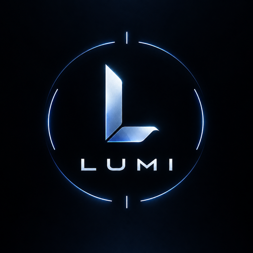

<p align=center></p>

<h1 align=center>Lumi</h1>

A minimal, clean desktop shell for [Hyprland](https://hypr.land), built on [Quickshell](https://quickshell.outfoxxed.me).
Ships with the `lumi` CLI for colour schemes, wallpapers, screenshots and more.

## Install (Arch Linux)

**The easy way:** [void193/Lumi](https://github.com/void193/Lumi) installs the whole desktop (this
shell, Hyprland, terminal, prompt, fonts, everything) from a fresh Arch install, with a step-by-step
guide starting from the Arch ISO:

```sh
git clone https://github.com/void193/Lumi.git && cd Lumi && ./install.sh
```

**Just the shell:** build and install the package from this repo (its AUR dependencies, e.g.
`quickshell-git` and `qt6-m3shapes-git`, need to be installed first):

```sh
git clone https://github.com/void193/LumiShell.git
cd LumiShell/packaging/arch
makepkg -si
```

Then start it with `lumi shell -d` (for example from your Hyprland config).

## Hacking on it

Symlink the repo as your Quickshell config so edits reload live:

```sh
ln -s ~/path/to/LumiShell ~/.config/quickshell/lumi
```

The compiled plugin (`plugin/`) still has to be installed through the package above.

## Layout

| Path         | What it is                                  |
| ------------ | ------------------------------------------- |
| `shell.qml`, `modules/`, `components/`, `services/`, `utils/` | the shell (QML) |
| `plugin/`    | C++ QML plugin (`Lumi.*` modules)      |
| `cli/`       | the `lumi` command-line tool (Python)  |
| `packaging/` | Arch PKGBUILD                               |

## Credits

Lumi is a fork. It stands on the work of:

-   [Caelestia shell](https://github.com/caelestia-dots/shell) and [Caelestia CLI](https://github.com/caelestia-dots/cli)
    by soramane and the caelestia-dots contributors. Their full git history is kept in this repo.
-   [Caelestia Live Wallpapers Integration](https://github.com/SunnydeuS/Caelestia-Live-Wallpapers-Integration)
    by SunnydeuS, for video wallpaper support.

## License

GNU GPL v3.0, see [LICENSE](LICENSE). Original copyright notices are retained;
changes made in Lumi are Copyright (C) 2026 Rubin Bastakoti.
